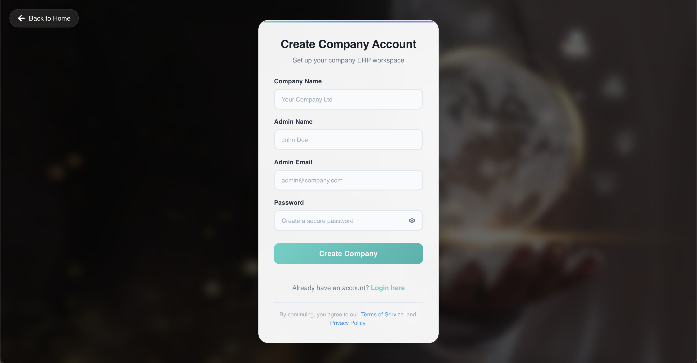
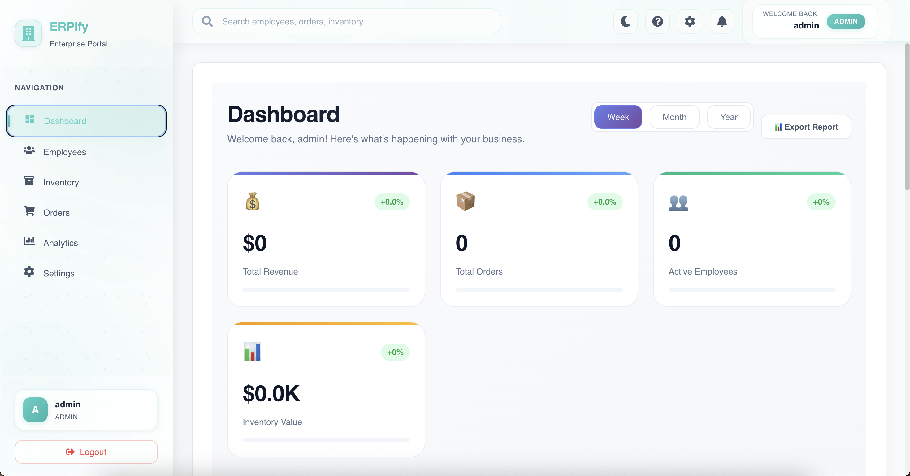
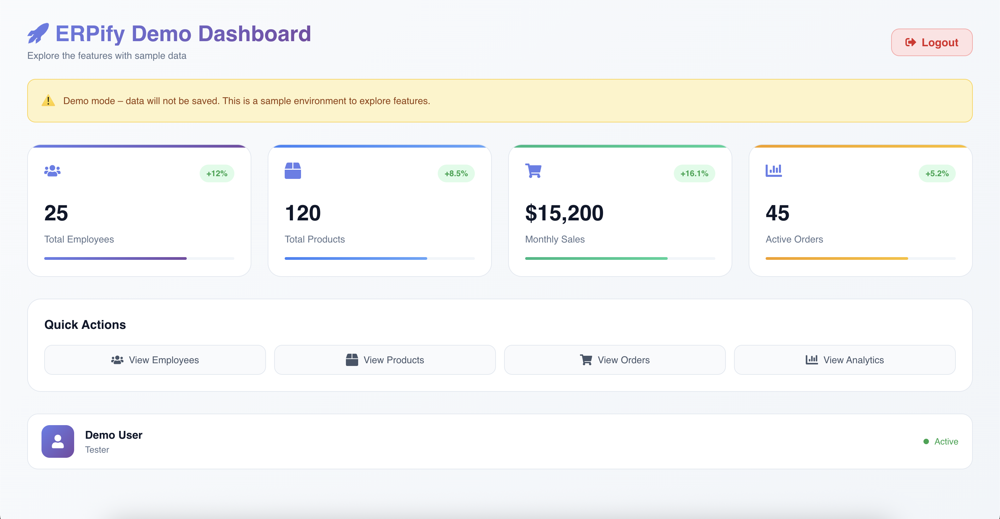
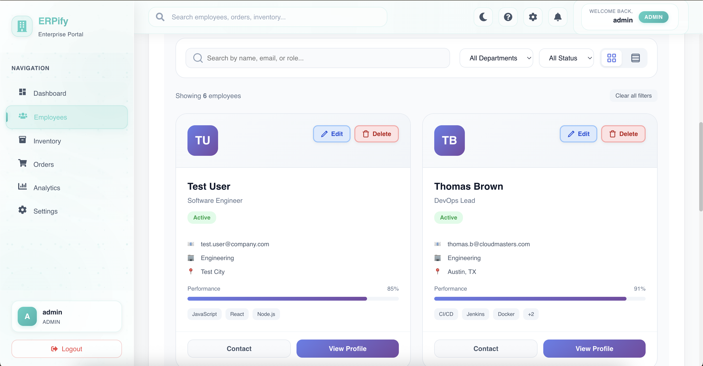
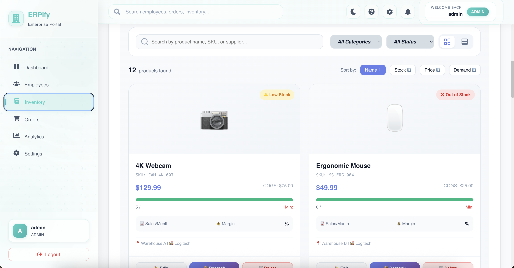
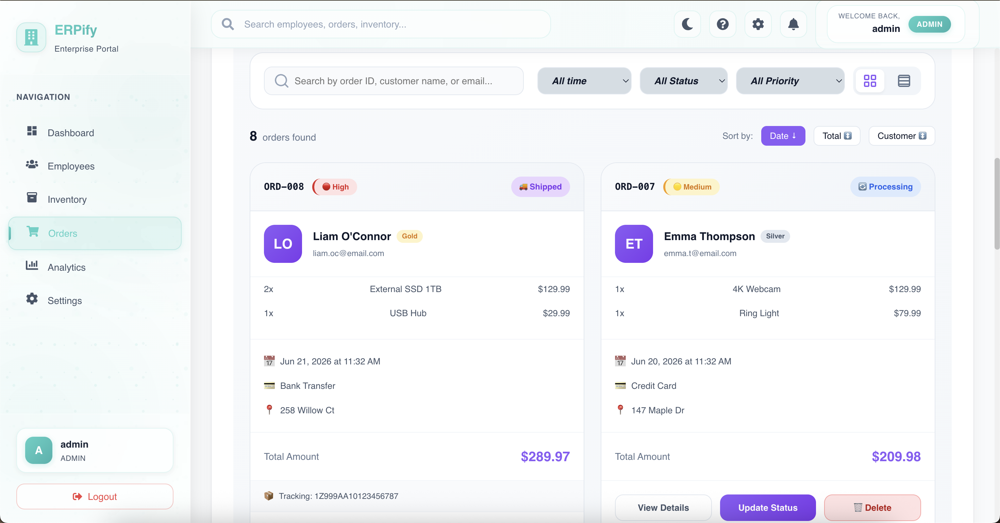

# 🏢 Multi-Tenant ERP Management System

> A modern full-stack Enterprise Resource Planning (ERP) platform built with React, Node.js, Express.js, and MySQL, designed to support multiple organizations through a secure and scalable multi-tenant architecture.

---

## 🚀 Overview

This ERP system is designed to centralize business operations while supporting **multiple organizations within a single application**.

The platform uses a **multi-tenant architecture**, allowing different organizations to operate independently while sharing the same application infrastructure.

Each tenant has isolated business data, users, roles, and operational information, providing a scalable foundation for SaaS-based ERP management.

---

## ⭐ Key Features

### 🏢 Multi-Tenancy

* Supports multiple organizations within a single ERP platform
* Tenant-based data isolation
* Organization-specific users and business data
* Secure tenant identification and validation
* Prevents unauthorized access between organizations
* Shared application infrastructure with logically separated tenant data
* Scalable architecture suitable for SaaS applications


### 📊 Centralized ERP Dashboard

* Organization-specific dashboard
* Real-time business information
* Key performance indicators
* Centralized access to ERP modules
* Data visualization and summaries

### 👥 Employee & Organization Management

* Employee records linked to individual organizations
* Organization-specific employee management
* User and role administration
* Structured organizational data

### 📦 Business Operations Management

* Centralized management of business data
* CRUD-based operational modules
* Search and filtering
* Data validation
* Organization-specific records

### 📈 Reporting & Analytics

* Tenant-specific reports
* Business performance insights
* Structured data analysis
* Dashboard-based reporting

### 🔒 Security

* Authentication and authorization
* Tenant-aware API requests
* Protected backend routes
* Environment-based configuration
* Secure database access
* Sensitive credentials excluded from version control

---

## 🏗️ Multi-Tenant Architecture

The core of the system is its **multi-tenant architecture**.

```text
                    ┌──────────────────────┐
                    │       React UI       │
                    └──────────┬───────────┘
                               │
                               ▼
                    ┌──────────────────────┐
                    │    Express REST API  │
                    └──────────┬───────────┘
                               │
                     Tenant Identification
                               │
                ┌──────────────┴──────────────┐
                │                             │
          Organization A               Organization B
                │                             │
                ▼                             ▼
        ┌───────────────┐             ┌───────────────┐
        │ Tenant Data A │             │ Tenant Data B │
        └───────────────┘             └───────────────┘
                       │
                       ▼
                 MySQL Database
```

### Tenant Isolation

Business records are associated with their respective tenant/organization identifiers.

Conceptually:

```text
Organization A
 ├── Users
 ├── Employees
 ├── Products
 ├── Transactions
 └── Reports

Organization B
 ├── Users
 ├── Employees
 ├── Products
 ├── Transactions
 └── Reports
```

This ensures that users belonging to one organization cannot access another organization's business information.

---

## 🛠️ Technology Stack

| Layer           | Technology                |
| --------------- | ------------------------- |
| Frontend        | React.js                  |
| Backend         | Node.js                   |
| API             | Express.js                |
| Database        | MySQL                     |
| Architecture    | Multi-Tenant              |
| Communication   | REST API                  |
| Authentication  | Role-Based Authentication |
| Version Control | Git & GitHub              |

---

## 🔄 Application Flow

```text
User Login
    ↓
Organization Identification
    ↓
Authentication
    ↓
Role Verification
    ↓
Tenant Validation
    ↓
Authorized API Request
    ↓
Tenant-Specific Database Query
    ↓
Organization-Specific Response
```

---

## 💡 What Makes This Project Different?

Unlike a basic management system designed for a single organization, this ERP is designed around a **multi-tenant model**.

The architecture allows:

* Multiple organizations to use the same application
* Independent organizational data
* Organization-specific users and permissions
* Tenant-aware backend APIs
* Scalable SaaS-style architecture
* Centralized application management
* Logical data isolation between tenants

---

## 📸 System Preview

### Dashboard



## 📸 System Preview

<p align="center">
  
  
</p>

<p align="center">
  
  
</p>

<p align="center">
  
</p>

---

## 🔮 Future Enhancements

* Subscription and billing management
* Tenant-specific customization
* Advanced analytics
* Audit logging
* Automated notifications
* Cloud deployment
* Two-factor authentication
* Advanced permission management
* Tenant usage monitoring
* Automated database backups

---

## 👩‍💻 Author

**Sinali Weerasinghe**

Full-Stack Developer | Software Engineering Student

**Tech:** React · Node.js · Express.js · MySQL

---

<p align="center">
  Built with ❤️ using React, Node.js, Express.js and MySQL
</p>
